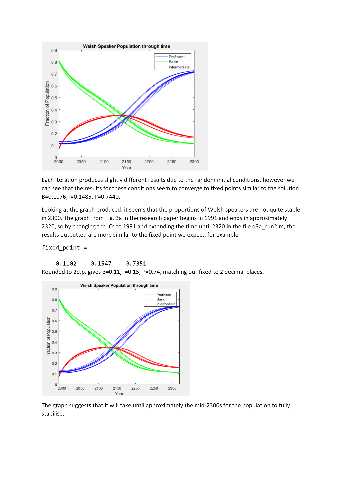

# MATLAB-Simulating-Dynamics-2020
Previous MATLAB work simulating dynamic systems e.g populations, chemical reactions.

## Language Population Dynamics
See PDF file for full report - for this, I simulated language dynamics for both Welsh and Maori using parameters from a previous study.

Example of graph created:

#### Figure 1: A graph showing the simulated proportions of Welsh speakers at basic, intermediate and proficient level from 2000 until 2300.

